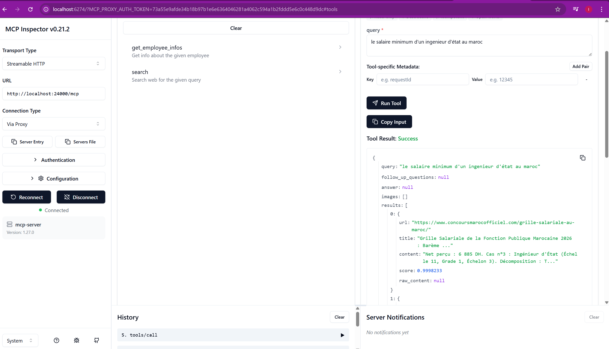
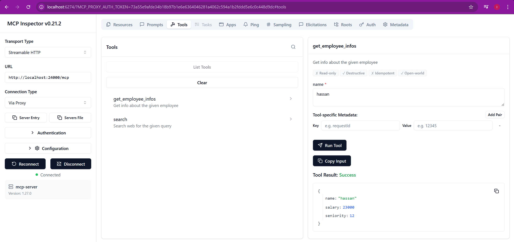
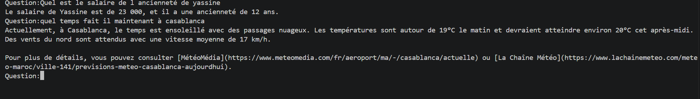
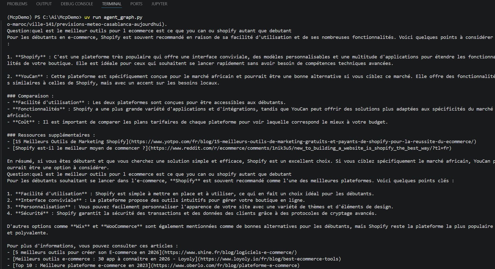
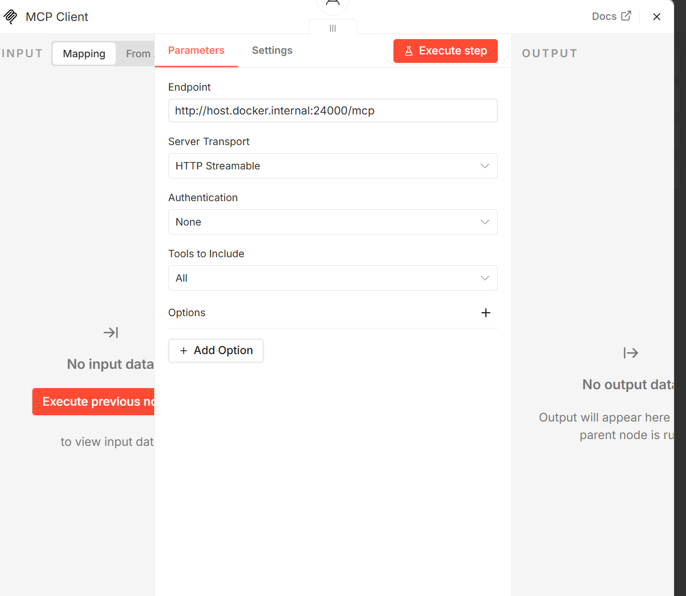
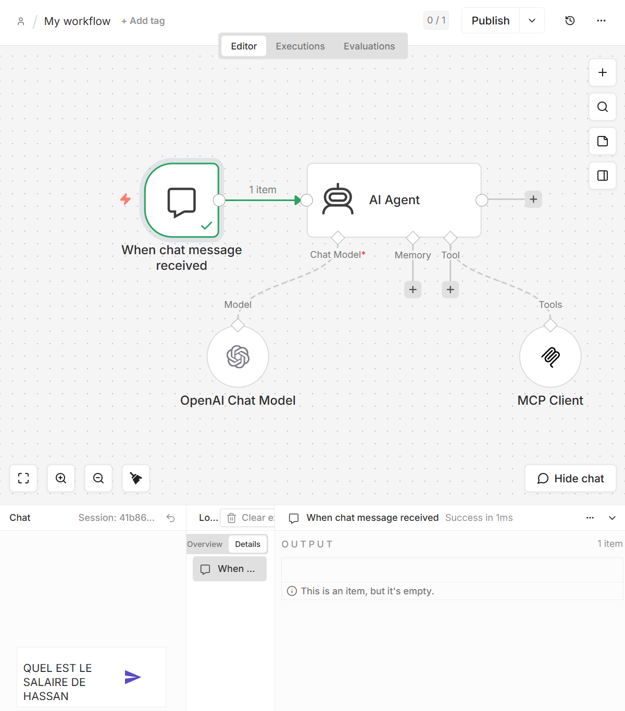
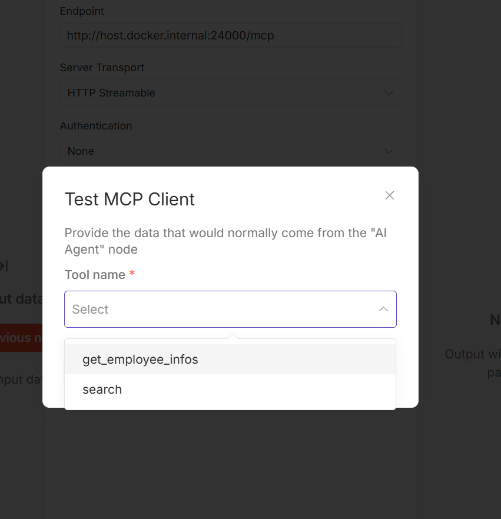
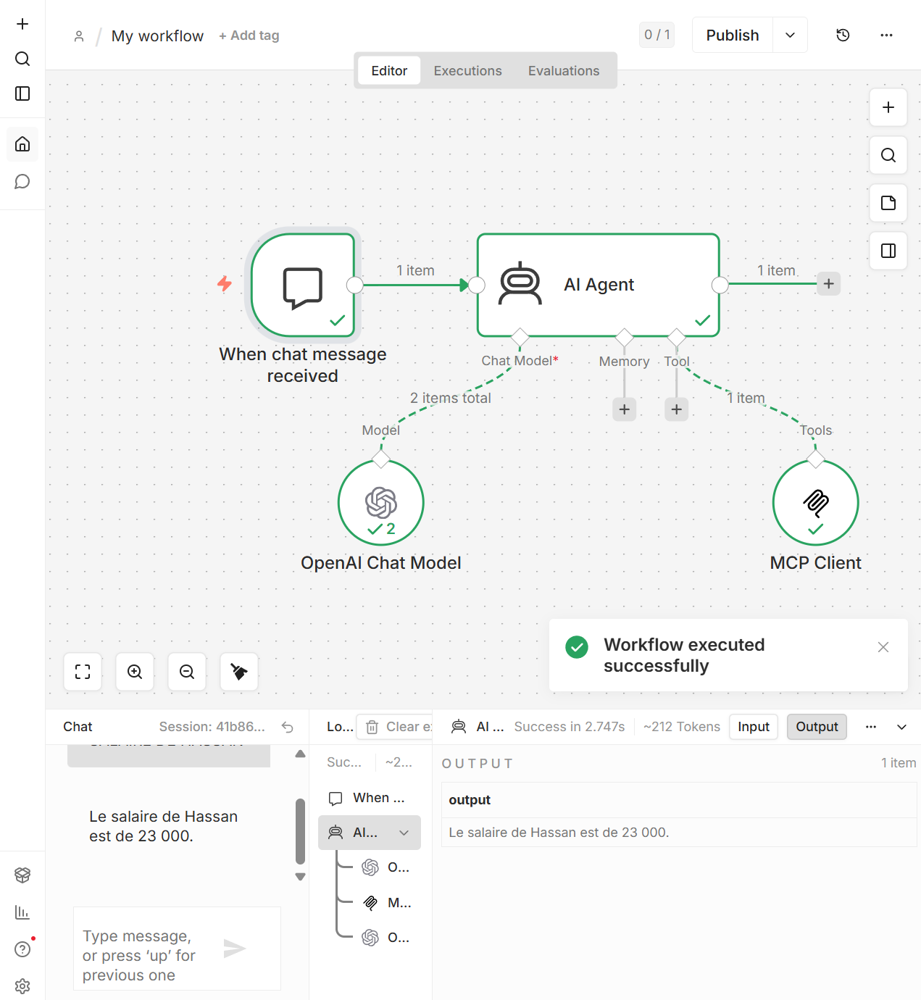

<div align="center">
  <h1>🚀 MCP Demo Project</h1>
  <p><i>A demonstration of Model Context Protocol (MCP) integration with LangChain and OpenAI</i></p>
  
  [](https://python.org)
  [](https://langchain.com)
  [](https://modelcontextprotocol.io/)
  [](https://n8n.io)
</div>

---

## 📖 Project Overview

This project serves as a practical demonstration of the **Model Context Protocol (MCP)**. It showcases how to create a custom MCP server that exposes specific tools, and how an AI agent (powered by LangChain, LangGraph, and N8N) can utilize those tools through the `streamable-http` protocol.

The project effectively bridges custom data/actions (like searching employee information or querying the web) with powerful Large Language Models.

---

## 🏗️ Architecture & Components

The application is built around two main components that communicate via the MCP protocol over HTTP:

### 1. 🛠️ MCP Server (`mcp-server.py`)
Built using `FastMCP`, this server exposes functions as tools that any MCP client can consume. 
- **`get_employee_infos(name: str)`**: A mock tool returning employee data (name, salary, seniority).
- **`search(query: str)`**: A web search tool powered by `TavilySearch`.
- *Runs on `http://localhost:24000/mcp` using the `streamable-http` transport.*

### 2. 🤖 LangChain Agent (`agent_graph.py` & `graph.ipynb`)
The intelligent client that interacts with the user.
- Uses `MultiServerMCPClient` to connect to the MCP server and dynamically fetch available tools.
- Employs `ChatOpenAI` (model: `gpt-4o-mini`) as the reasoning engine.
- Binds the fetched tools to the agent, allowing it to autonomously decide when to search the web or fetch employee info based on the user's prompt.
- Available both as a terminal script (`agent_graph.py`) and an interactive Jupyter Notebook (`graph.ipynb`).

### 3. 🔄 N8N Workflow Agent
A workflow automation platform that integrates with the MCP server to orchestrate complex business processes.
- **Local Installation via Docker**: N8N is deployed locally using Docker containers for easy setup and isolation.
- Connects to the MCP server via the `streamable-http` protocol.
- Allows visual workflow design for automating interactions with the MCP tools.
- Provides an alternative to code-based agents for non-technical users.

---

## 📂 Project Structure

```text
📁 McpDemo/
├── 📄 mcp-server.py      # FastMCP server exposing tools
├── 📄 agent_graph.py     # Terminal-based LangChain agent client
├── 📓 graph.ipynb        # Jupyter Notebook demonstrating agent capabilities
├── 📄 main.py            # Simple entry point
├── 📄 pyproject.toml     # Project metadata and dependencies (uv/pip)
├── 📄 .env               # Environment variables (OpenAI API key, Tavily API key)
└── 📄 README.md          # Project documentation (You are here!)
```

---

## 📸 Screenshots

Here is a visual overview of the MCP Demo in action:

### A. Server Initialization

*Description: Starting the FastMCP server, which exposes the employee information and web search tools on port 24000.*

### B. Agent Interaction

*Description: The LangChain agent connecting to the MCP server and dynamically discovering the available tools.*

### C. Web Search Tool Execution

*Description: The agent utilizing the `search` tool (powered by TavilySearch) to fetch real-time information from the web.*

### D. Employee Info Tool Execution

*Description: The agent calling the `get_employee_infos` tool to retrieve internal mock data about an employee.*

### A1. Détail de l'Initialisation

*Description: Aperçu détaillé de la phase d'initialisation du système et de la préparation des composants.*

### A2. Connexion et Découverte

*Description: Étape de connexion du client LangChain et découverte des outils disponibles sur le serveur MCP.*

### A3. Analyse et Exécution

*Description: L'agent analyse la requête de l'utilisateur et exécute les outils appropriés en temps réel.*

### A4. Synthèse des Résultats

*Description: Affichage de la réponse finale formulée par l'agent à partir des données récupérées.*

---

## 🚀 Getting Started

### Prerequisites
- Python 3.13 or higher.
- API Keys for OpenAI (`OPENAI_API_KEY`) and Tavily (`TAVILY_API_KEY`).
- Docker and Docker Compose (for N8N workflow deployment).

### Installation

1. **Clone or navigate to the project directory.**
2. **Install dependencies** (the project uses standard Python packaging tools, e.g., `uv` or `pip`):
   ```bash
   pip install -e .
   # or if using uv
   uv sync
   ```
3. **Set up Environment Variables**: Ensure your `.env` file contains the necessary API keys.
   ```env
   OPENAI_API_KEY=your_openai_api_key_here
   TAVILY_API_KEY=your_tavily_api_key_here
   ```

### Running the Demo

This demo requires running the server and the client in separate terminal windows.

**Step 1: Start the MCP Server**
```bash
python mcp-server.py
```
*The server will start listening on port 24000.*

**Step 2: Run the Agent Client**
In a new terminal window, run the agent:
```bash
python agent_graph.py
```
*You can now type your questions. For example: "Quel est le salaire de hassan ?" or "Fais une recherche web sur les outils e-commerce".*

Alternatively, you can open and run the cells in `graph.ipynb` for an interactive notebook experience.

---

## 🔧 N8N Workflow Integration

### Setup N8N Locally with Docker

N8N is deployed locally using Docker containers, providing a no-code/low-code interface for creating workflows that interact with the MCP server.

**Prerequisites:**
- Docker and Docker Compose installed on your machine.

**Step 1: Start N8N with Docker**
```bash
docker-compose up -d n8n
```

**Step 2: Access N8N**
Open your browser and navigate to:
```
http://localhost:5678
```

**Step 3: Create a Workflow**
- Design a new workflow in the N8N interface.
- Add HTTP nodes to communicate with the MCP server at `http://localhost:24000/mcp`.
- Configure the nodes to call the available MCP tools (`get_employee_infos`, `search`).
- Execute the workflow to test the integration.

**Example Docker Compose Configuration:**
```yaml
version: '3'
services:
  n8n:
    image: n8nio/n8n
    ports:
      - "5678:5678"
    environment:
      - N8N_HOST=localhost
      - N8N_PORT=5678
      - WEBHOOK_URL=http://localhost:5678/
    volumes:
      - n8n_data:/home/node/.n8n
    networks:
      - mcp-network

volumes:
  n8n_data:

networks:
  mcp-network:
    driver: bridge
```

---

